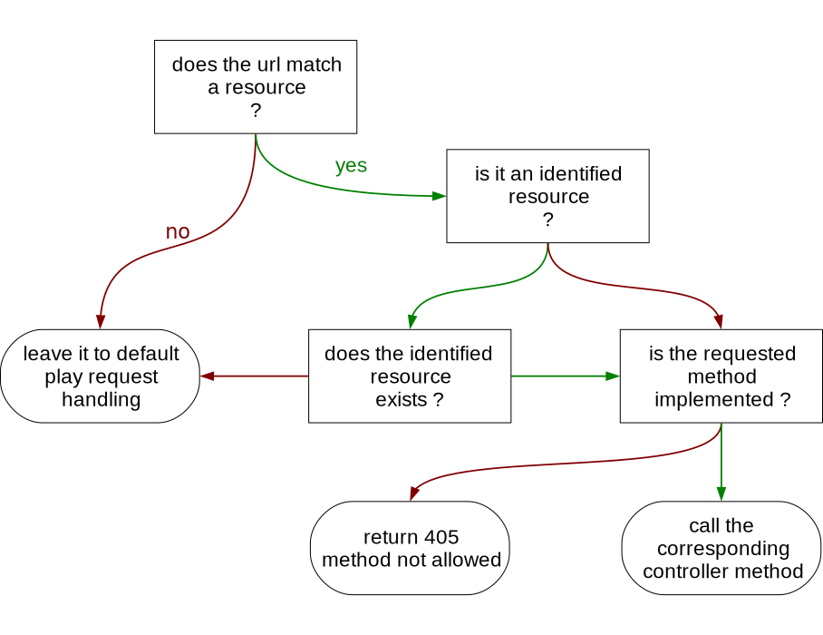

=============
Play'R basics
=============

Play'R is created to simplify ReST api declaration and tries to answer to HTTP request with correct defaults.

This includes correct error handling but also a mapping from HTTP method to scala method names (enforced via traits implementation)

Namespace, resources, actions
=============================

A little glossary for terms used in this documentation

Namespace:
  It's a simple way to group related resources under a common url prefix. A namespace is declared using a RestApiRouter

  Example: ``/crm``

Resource:
  It's a simple object, in this case accessed via HTTP. 

  For each resource you have a collection of items.

  The collection is accessed through the base resource URL and let you list and create items.

  Example: ``/crm/company``

Identified resource:
  It's an item in a resource collection.

  Individual items are accessed through an identified resource URL and let you get, update and delete items.

  An identified resource URL is the base resource URL followed by an identifier.

  Example: ``/crm/company/2``

Sub-resource:
  It's a resource that can only be accessed via an other resource.

  Example: ``/crm/company/2/employee/5``

Action:
  It's an extra method attached to an identified resource.

  Example: ``/crm/company/2/functions``

HTTP method mapping
===================

To answer HTTP request, Play'R defines a set of traits you should implement depending on what HTTP method you want to support.

For url starting only with the resource name, like: ``/resource`` there are only two possible methods: list and create with the following mapping:

   +-------------------+--------------------+------------------+
   | HTTP Method       | Play'R trait       | Scala method     |
   +===================+====================+==================+
   | GET               | ResourceRead       | list             |
   +-------------------+--------------------+------------------+
   | POST              | ResourceCreate     | create           |
   +-------------------+--------------------+------------------+

For identified resources, with url like: ``/resource/id``, the following mappings are defined:

   +-------------------+--------------------+------------------+
   | HTTP Method       | Play'R trait       | Scala method     |  
   +===================+====================+==================+
   | GET               | ResourceRead       | get(id)          |
   +-------------------+--------------------+------------------+
   | PUT               | ResourceWrite      | write(id)        |
   +-------------------+--------------------+------------------+
   | DELETE            | ResourceDelete     | delete(id)       |
   +-------------------+--------------------+------------------+
   | PATCH             | ResourceUpdate     | update(id)       |
   +-------------------+--------------------+------------------+

The HTTP ``OPTION`` method is handled by the Play'R router and returns the expected Allow content depending on the implemented scala traits.

Error handling
==============

Play'R routing algorithm tries return meaning full HTTP response code depending on the requested url and http method.

For each request, the following algorithm is applied:

Most of the time leaving handling to play means a 404 error, but you can add specific cases in your play route file to take care of requests Play'R does not understand.

